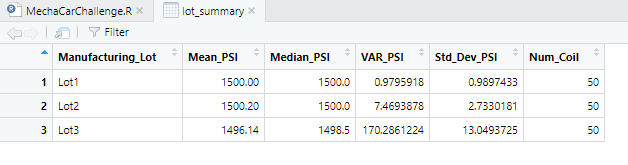
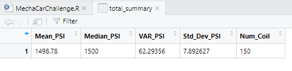
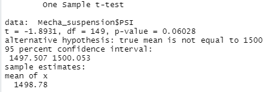
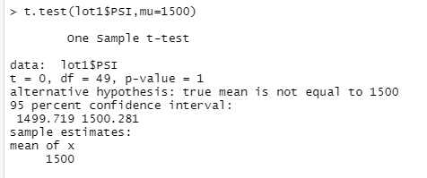
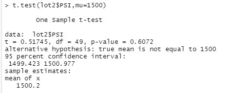
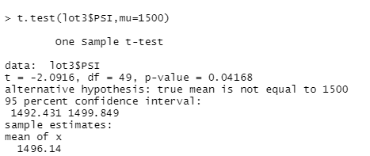

# MechaCar_Statistical_Analysis - Challenge Number 15 

## Summary Statistics on Suspension Coils

***
* Design Specifications by Lot

As shown in the lot summary table below, the variance of the suspension coils for the first two lots are within the limit of 100 pounds per square inch, however the third lot is well outside the contstraints of 100 PSI at over 170.2861224 PSI.  Given that the third lot is not in line with the the other two, it does not meet the design specification standard.  

If we take a further look at the summary which evaluates all the data instead of breaking it down by lot, the design specification is well under the maximum PSI at 62.29356 which can be shown below.  

## T-Tests on Suspension Coils

*** 

* T-Tests on the Population Mean for All Manufacturing Lots

As indicated previously, it appears that when comparing the data as a whole, the PSI across all manufacturings lots is not that far off from the population mean of 1,500 pounds per square inch. As shown in the first t.test which accounts for all of the data, the mean is 1498.78.  

* T-Test Results by Lot

Furthermore, as shown below, lots one and two are right at the population mean of 1500 with lot one with a mean right at 1500 PSI and lot two with a mean at 1500.2 PSI. 

The lot with the greatest variance from the mean is lot three which has an average of 1496.14 PSI.  

## Study Design: MechaCar vs Competition

In order to better evaluate how MechaCar compares to that of its competitors, the metrics that I would test would be the following:

***
* Crash Rating - How well MechaCar compares in crash test ratings and real life examples. 
* Cost - In a very cost concious economy, I would take in to account the pricing of MechaCar vs. their competitors. 
* Availability - With rising demand for new and used cars, I would evaluate the availability of MechaCar for purchases on the lot vs. being back ordered. 
* Highway Fuel Efficiency - As cost in a post-pandemic world is still a large decision factor in new car purchases, I would further evaluate the fuel efficiency of MechaCar vs. competitors. 

The alternative hypothesis of the above factors would predict that consumers prefer MechaCar over competitors as our research supports a lower cost, better MPG, higher standard for safety and a large availability.  I would use a t.test to compare our data with that of competitors as t.tests are used to compare the means of two groups.  The data that would be needed to support our hypothesis would be average cost, mpg, crash rating, and perhaps a percentage of availability of cars on dealer lots.  

